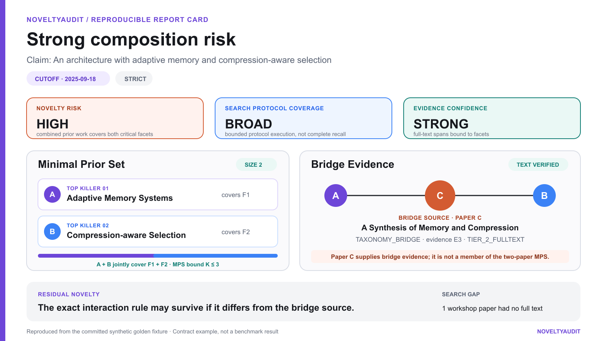

<p align="center">
  
</p>

<p align="center">
  <strong>No single paper kills your novelty? Maybe three do.</strong>
</p>

<p align="center">
  <a href="https://github.com/niansia/NoveltyAudit/releases"></a>
  <a href="https://github.com/niansia/NoveltyAudit/actions/workflows/ci.yml"></a>
  <a href="LICENSE"></a>
  <a href="https://github.com/agentskills/agentskills"></a>
  <a href="README.zh-TW.md"></a>
  <a href="README.zh-CN.md"></a>
</p>

NoveltyAudit is an evidence-first Agent Skill for adversarial scholarly novelty audits. It asks a harder question than “Which paper is most similar?”:

> What is the smallest set of prior papers that can collectively cover the critical parts of this claim—and is there historical evidence that they were meaningfully connected?

The result is not a novelty score. It is an auditable claim map, historically eligible evidence, the smallest qualifying set of prior papers, bridge evidence between them, remaining novelty, and an explicit account of what the search could not establish.

## Quick start

### Requirements

| Requirement | Needed? |
|---|---|
| Agent Skills-compatible host | Yes |
| Python | 3.10+ |
| Network access to scholarly providers | Yes |
| Permission to execute local scripts | Yes |
| Separate paid LLM API key | No |
| OpenAlex or Semantic Scholar API key | Optional |

### One-line skill install

If Node.js and `npx` are available, the open-source [skills CLI](https://skills.sh/docs/cli) discovers the nested skill and installs it for supported agents:

```bash
npx skills add niansia/NoveltyAudit --skill scholarly-novelty-audit --global
```

The skills CLI installs the skill package; it does not install Python dependencies. On first use, NoveltyAudit will still verify Python 3.10+ and install its Python requirements when the host permits dependency installation.

The third-party installer records anonymous install telemetry by default; set `DISABLE_TELEMETRY=1` to opt out. Use the manual path below if you do not want to use the installer.

### Manual install

Download the current `scholarly-novelty-audit-v*.zip` and its `.sha256` file from [GitHub Releases](https://github.com/niansia/NoveltyAudit/releases), then verify the archive:

The commands below assume that the downloaded ZIP and checksum are the only matching release files in the current directory. They install to Codex's skill directory; for Claude Code, replace `.codex` with `.claude`. Other Agent Skills clients may use a different discovery path.

#### Windows 10/11 (PowerShell)

```powershell
$archive = Get-ChildItem .\scholarly-novelty-audit-v*.zip | Select-Object -First 1
$expected = ((Get-Content "$($archive.FullName).sha256" -Raw) -split '\s+')[0]
$actual = (Get-FileHash -Algorithm SHA256 $archive.FullName).Hash
if ($actual -ne $expected) { throw "SHA-256 verification failed" }

Expand-Archive -LiteralPath $archive.FullName -DestinationPath . -Force
$skillPath = "$env:USERPROFILE\.codex\skills\scholarly-novelty-audit"
New-Item -ItemType Directory -Force -Path $skillPath | Out-Null
Copy-Item .\scholarly-novelty-audit\* $skillPath -Recurse -Force
python -m pip install -r "$skillPath\requirements.txt"
```

#### Ubuntu and other mainstream Linux distributions

```bash
sha256sum -c scholarly-novelty-audit-v*.zip.sha256
unzip -q scholarly-novelty-audit-v*.zip
mkdir -p "$HOME/.codex/skills"
cp -R scholarly-novelty-audit "$HOME/.codex/skills/"
python3 -m pip install -r "$HOME/.codex/skills/scholarly-novelty-audit/requirements.txt"
```

#### macOS

```bash
shasum -a 256 -c scholarly-novelty-audit-v*.zip.sha256
unzip -q scholarly-novelty-audit-v*.zip
mkdir -p "$HOME/.codex/skills"
cp -R scholarly-novelty-audit "$HOME/.codex/skills/"
python3 -m pip install -r "$HOME/.codex/skills/scholarly-novelty-audit/requirements.txt"
```

To install from a repository clone instead of a release archive, clone the repository and copy its nested skill directory. On Windows PowerShell:

```powershell
git clone https://github.com/niansia/NoveltyAudit.git
$skillPath = "$env:USERPROFILE\.codex\skills\scholarly-novelty-audit"
New-Item -ItemType Directory -Force -Path $skillPath | Out-Null
Copy-Item .\NoveltyAudit\scholarly-novelty-audit\* $skillPath -Recurse -Force
python -m pip install -r "$skillPath\requirements.txt"
```

On Linux or macOS:

```bash
git clone https://github.com/niansia/NoveltyAudit.git
mkdir -p "$HOME/.codex/skills"
cp -R NoveltyAudit/scholarly-novelty-audit "$HOME/.codex/skills/"
python3 -m pip install -r "$HOME/.codex/skills/scholarly-novelty-audit/requirements.txt"
```

Then ask your agent:

```text
Use $scholarly-novelty-audit on this claim:
“We are the first to combine adaptive memory with compression-aware selection
for long-video vision-language reasoning.”

Cutoff: 2025-09-18.
Be adversarial. Return the top five killer candidates, a Minimal Prior Set of
at most three papers, strict date filtering, residual novelty, and Markdown + JSON.
```

> **Private-manuscript note:** search queries and identifiers are sent to configured scholarly providers. Do not transmit confidential manuscript text without authorization. Minimize private wording where possible and review the [privacy model](scholarly-novelty-audit/references/privacy-model.md) before auditing unpublished work.

### Supported hosts

| Host | Integration |
|---|---|
| OpenAI Codex | Agent Skill plus native `agents/openai.yaml` UI metadata; install under `~/.codex/skills/` |
| Claude Code | Agent Skills-compatible folder; install under `~/.claude/skills/` |
| Other Agent Skills clients | Spec-compatible package; discovery path and script permissions are client-specific |

Keep the installed folder named `scholarly-novelty-audit`.

## Example audit result

<p align="center">
  
</p>

Reproduced from the committed synthetic [golden composition fixture](scholarly-novelty-audit/tests/fixtures/composition-report.json). **Contract example, not a benchmark result.** Paper C supplies bridge evidence; it is not a member of the two-paper MPS.

<details>
<summary>Accessible text version</summary>

```text
NoveltyAudit Report

Novelty Risk: HIGH
Search Protocol Coverage: BROAD
Coverage scope: Protocol execution only; this is not demonstrated recall of all relevant literature.
Evidence Confidence: STRONG
Classification: STRONG_COMPOSITION_RISK

Paper A and Paper B jointly cover both critical facets,
and Paper C explicitly connects them.

Input
Claim: We introduce an architecture with adaptive memory and compression-aware selection.
Cutoff: 2025-09-18 (strict)

Frozen Claim Map
F1 | mechanism   | adaptive memory              | critical
F2 | interaction | compression-aware selection  | critical

Top Killer Papers
1. Adaptive Memory Systems — covers F1; does not cover F2
2. Compression-aware Selection — covers F2; does not cover F1

Minimal Prior Set
MPS search bound: K ≤ 3.
Adaptive Memory Systems + Compression-aware Selection covers: F1, F2

Bridge Evidence
TAXONOMY_BRIDGE: papers A, B; evidence E3

Residual Novelty
The exact interaction rule may survive if it differs from the bridge source.

Defensible Claim Rewrite
Prior work separately covers adaptive memory and compression-aware selection;
we introduce a specific interaction rule between them.

Search Gaps
One workshop paper had no full text.
```

</details>

`BROAD` describes execution of a bounded protocol; it does not claim complete recall of all relevant literature.

## Real failure modes

Tests prove that the contracts execute; [`case-studies/`](case-studies/README.md) shows why the product exists:

- **Missing killer paper** - a `SYNTHETIC` golden case where a novelty-threatening paper is absent from the supplied bibliography.
- **Composition attack** - a `REVIEWER_GROUNDED` SafePatching case in which a reviewer-derived concern names SNIP, Super Mario, and HFT as a combination of prior mechanisms.
- **Claim structure / residual novelty** - a `PUBLIC_CASE_STUDY` that decomposes RAG into BART, DPR, REALM, and the interaction that may remain novel.

Every case has a human-readable README, a schema-validated `case.json`, stable paper identifiers, a historical cutoff, source and license provenance, and explicit limitations. No PDFs, review dumps, or confidential manuscripts are committed. The reviewer-grounded and public cases do not claim end-to-end NoveltyAudit performance.

## When to use it

| Good fit | Not the right tool |
|---|---|
| A specific research claim with a historical cutoff | General literature review |
| Pre-submission novelty stress testing | Topic discovery or quick similarity search |
| Reviewer-response preparation and claim rewriting | An unbounded “is my idea novel?” opinion |
| Multi-paper composition attacks | Patentability or freedom-to-operate analysis |
| Reviewer-defensible date and evidence verification | Legal prior-art opinions |

If dates, full text, graph coverage, or search obligations are insufficient, the correct result is `INCONCLUSIVE`.

## Why it is different

| Common novelty workflow | NoveltyAudit |
|---|---|
| Ranks individually similar papers | Solves an evidence-bound **Minimal Prior Set** of 1–3 papers |
| Treats any combination as an attack | Requires **Bridge Evidence** before a strong composition verdict |
| Filters by publication year | Resolves the **earliest verified public date** and isolates uncertainty |
| Emits one confidence or novelty score | Separates **Novelty Risk**, **Search Protocol Coverage**, and **Evidence Confidence** |
| Turns “no results” into reassurance | Records coverage limits and permits **INCONCLUSIVE** |

Retrieval breadth is infrastructure; NoveltyAudit's differentiator is the composition, evidence, temporal, and audit contract. See the dated [landscape review](docs/landscape.md) for comparisons with adjacent open-source projects.

## How it works

<p align="center">
  
</p>

1. **Freeze the claim.** Decompose it into critical mechanisms, interactions, and constraints before retrieval.
2. **Search adversarially.** Query OpenAlex, Semantic Scholar, and arXiv across literal, mechanism, problem/function, ancestor, and composition-bridge families.
3. **Verify evidence and time.** Deduplicate versions, resolve the earliest public date, acquire public full text, and bind evidence spans to claim facets.
4. **Prosecute the claim.** Find the smallest prior-paper set that covers the critical facets and expand citation graphs to test whether the papers were historically connected.
5. **Fail closed.** Recompute invariants, bind runtime provenance, cap incomplete audits at `INCONCLUSIVE`, and export Markdown, JSON, or HTML only from a valid machine-bound report.

## What NoveltyAudit actually checks

- Claim decomposition and five-family adversarial query planning.
- OpenAlex, Semantic Scholar, arXiv, and Crossref adapters with canonical record normalization.
- Strict earliest-public-date resolution and explicit `ELIGIBLE`, `POST_CUTOFF`, and `DATE_UNCERTAIN` states.
- Public Tier-2 PDF, HTML, and text acquisition with hashes and evidence-to-source binding.
- Evidence-bound Minimal Prior Set solving with `K ≤ 3`.
- Multi-provider backward/forward graph expansion, bridge verification, observation-window diagnostics, and separate post-cutoff landscape bridges.
- Deterministic report invariants, machine-bound runtime provenance, snapshot diffing, and Markdown/JSON/HTML export.
- JSON Schemas, adversarial tests, a golden composition fixture, and a benchmark annotation schema.

The host agent performs claim decomposition and evidence interpretation. The bundled Python scripts perform deterministic retrieval bookkeeping, normalization, date resolution, graph expansion, MPS solving, validation, and rendering; they do not call an LLM.

## Verdicts

| Verdict | Meaning |
|---|---|
| `DIRECT_PRECEDENT` | One eligible paper covers every critical facet with evidence. |
| `STRONG_COMPOSITION_RISK` | Two or three eligible papers cover the claim and textual bridge evidence supports the combination. |
| `PLAUSIBLE_COMPOSITION_RISK` | The set covers the claim, but only graph-level bridge evidence is verified. |
| `FRAGMENTED_PRECEDENT` | Components are individually known, but no meaningful historical bridge is verified after complete required expansion. |
| `RESIDUAL_NOVELTY` | At least one critical mechanism or interaction remains uncovered. |
| `INCONCLUSIVE` | Search coverage, dates, full text, graph expansion, or evidence are insufficient. |

These are bounded audit classifications, not guarantees of originality or legal conclusions.

## Exploratory evidence from 82 reviewer-annotated cases

These are exploratory measurements from 82 licensed reviewer-annotated cases, not performance scores for NoveltyAudit:

| Measurement | Observed result | What it supports |
|---|---:|---|
| Cases with at least two deterministically detected reviewer-named priors | **23/82 (28.05%)** | A detected mention rate in this sample, not composition-objection prevalence |
| Complete multi-prior cases with a pre-cutoff co-citation bridge | **4/18 (22.22%)** | A minority signal with wide uncertainty (exact 95% interval: 6.41%–47.64%) |
| Named priors with nonempty backward references after OpenAlex + Semantic Scholar fallback | **56/83 (67.47%)** | Observed provider coverage, not literature recall |

The study changed the product: Bridge Evidence is treated as a conditional positive signal, while an absent bridge never becomes a universal negative test. End-to-end reviewer-grounded Recall@5, MRR, and reviewer-prediction performance remain unmeasured. See the full [empirical status and limitations](docs/empirical-status.md).

## Trust, privacy, and scope

Provider keys are optional for basic use. `S2_API_KEY` reduces Semantic Scholar throttling; `OPENALEX_API_KEY` raises the OpenAlex allowance. OpenAlex's retired polite-pool `mailto` mechanism is not used.

Search terms and identifiers leave the local machine when the skill queries scholarly providers. Confidential manuscripts should be minimized or withheld unless transmission is authorized; the exact boundary is documented in the [privacy model](scholarly-novelty-audit/references/privacy-model.md).

The release workflow clean-installs on Ubuntu and macOS, validates the Agent Skill, rebuilds the allowlisted runtime ZIP, checks its license and SHA-256 sidecar, and then publishes it. Runtime archives exclude tests, benchmark data, local runs, and caches.

NoveltyAudit performs scholarly-literature reconnaissance only. It does not provide patentability, non-obviousness, freedom-to-operate, or any other legal opinion.

## Project status

**Alpha.** The deterministic pipeline, schemas, validators, packaging, and offline test suite are implemented. The CLI and report schema may still evolve before 1.0. Reviewer-grounded end-to-end retrieval and prediction performance are not yet established, and the project does not manufacture benchmark claims to fill that gap.

## Advanced use and technical contracts

The skill's [reasoning contract](scholarly-novelty-audit/SKILL.md) is intentionally concise. Detailed guarantees live in progressive references:

- [Deterministic CLI and coverage derivation](scholarly-novelty-audit/references/tooling.md)
- [Minimal Prior Set semantics](scholarly-novelty-audit/references/minimal-prior-set.md)
- [Bridge discovery, promotion, and negative-result limits](scholarly-novelty-audit/references/bridge-evidence.md)
- [Temporal cutoff rules](scholarly-novelty-audit/references/temporal-cutoff.md)
- [Evidence tiers and admissibility](scholarly-novelty-audit/references/evidence-rules.md)
- [Report fields and invariant contract](scholarly-novelty-audit/references/report-schema.md)
- [Privacy model](scholarly-novelty-audit/references/privacy-model.md)

Representative commands:

```bash
python scholarly-novelty-audit/scripts/cli.py search-plan \
  --input run/query-plan.json --output run/candidates.json

python scholarly-novelty-audit/scripts/cli.py expand-graph \
  --papers run/dated.json --paper-a W123 --paper-b W456 \
  --cutoff 2025-09-18 --limit 100 --output run/expanded.json

python scholarly-novelty-audit/scripts/cli.py report-attempt \
  --input run/report.verified.json --output run/report.bound.json \
  --state run/report-assembly.json --max-attempts 3

python scholarly-novelty-audit/scripts/cli.py validate --input run/report.bound.json
python scholarly-novelty-audit/scripts/cli.py export \
  --input run/report.bound.json --format markdown --output run/report.md
```

Exit codes are stable and automation-friendly: `0` complete, `10` partial, `20` no searchable claim, `30` all providers failed, `40` validation failed, and `50` configuration or credential error.

## Test

```bash
python -m pytest scholarly-novelty-audit/tests -q
skills-ref validate ./scholarly-novelty-audit
```

Core algorithms and adversarial invariants run offline. Live provider smoke tests may be throttled and must report those failures explicitly.

## Roadmap

The next milestone is a preregistered, licensed, end-to-end reviewer-grounded pilot: bibliography-absent killer papers, genuine composition concerns, ancestor-term recoveries, temporal traps, and false-positive defenses. See [empirical status](docs/empirical-status.md), [release acceptance](docs/release-acceptance.md), [benchmark policy](scholarly-novelty-audit/benchmark/README.md), and [data licenses](docs/DATA_LICENSES.md).

## Contributing

High-value contributions are public reviewer-grounded cases, provider adapters, date golden tests, bridge-evidence edge cases, and report-faithfulness failures. Share audit results, installation questions, methodology discussions, and ideas in [GitHub Discussions](https://github.com/niansia/NoveltyAudit/discussions); use Issues for reproducible defects. Read [CONTRIBUTING.md](CONTRIBUTING.md), [SECURITY.md](SECURITY.md), and [release packaging](docs/releasing.md). Citation metadata is in [CITATION.cff](CITATION.cff); source code is licensed under [Apache-2.0](LICENSE).

If NoveltyAudit finds a paper your reviewer could have found first, star the repo.
